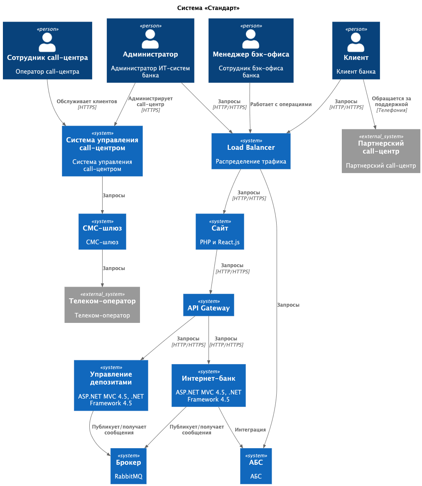
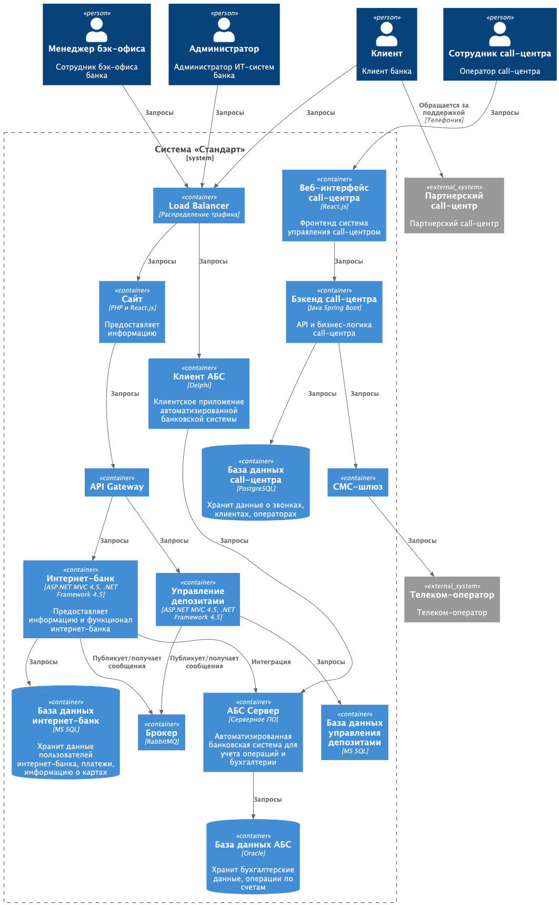

### **Название задачи:** Открытие депозитов онлайн
### **Автор:** Коваль Александр
### **Дата:** 02122025
### **Функциональные требования**
> Опишите здесь верхнеуровневые Use Cases. Их нужно оформить в виде таблицы с пошаговым описанием:

| **№** | **Действующие лица или системы** | **Use Case**                                                                                                           | **Описание**                                                                                                                                                                                                                                          |
|:-----:|:---------------------------------|:-----------------------------------------------------------------------------------------------------------------------|:------------------------------------------------------------------------------------------------------------------------------------------------------------------------------------------------------------------------------------------------------|
|  UC1  | Новый клиент                     | Я, как новый клиент банка, могу видеть список доступных депозитов с актуальными ставками на сайте                      | 1. Клиент заходит на страницу депозитов    2. Клиент видит отображение доступных актуальны депозитов                                                                                                                                          |
|  UC2  | Новый клиент                     | Я, как новый клиент банка, могу оставить заявку на открытие депозита, указав Ф. И. О. и номер телефона                 | 1. Клиент заходит на страницу заявок    2. Клиент заполняет форму заявки   3. Клиент отправляет валидную заявку                                                                                                                           |
|  UC3  | Новый клиент                     | Я, как новый клиент банка, могу получить специальные условия по заявке на открытие депозита после одобрения заявки     | 1. Клиент подает заявку на открытие депозита   2. Менеджер получает заявку   3. Менеджер связывается с клиентом и предлагает специальные условия                                                                                          |
|  UC4  | Новый клиент                     | Я, как новый клиент банка, должен придти в банк для идентификации личности                                             | 1. Клиент подает заявку на открытие депозита   2. Менеджер одобряет заявку   3. Менеджер связывается с клиентом   4. Клиент приходит в отделение банка для идентификациии личности и получения документов                             |
|  UC5  | Клиент                           | Я, как клиент банка, могу видеть в онлайн-банке список актуальных и персонализированных ставок                         | 1. Клиент входит в свою учётную запись   2. Система рассчитывает персонализированные ставки   3. Онлайн-банк отображает клиенту стандартные и персонализированные ставки                                                                  |
|  UC6  | Клиент                           | Я, как клиент банка, могу указать счёт, сумму депозита и могу подать заявку на открытие депозита                       | 1. Клиент входит в свою учётную запись   2. Переходит на страницу открытия депозита   3. Заполняет форму и отправляет запрос   4. Система СМС отправляет клиенту код в СМС   5. Клиент подтверждает заявку на открытие депозита   |
|  UC7  | Клиент                           | Я, как клиент банка, должен получить СМС уведомление после подтверждения размера ставки и открытия депозита менеджером | 1. Клиент входит в свою учётную запись <br/ 2.Клиент подаёт заявку   3. Менеджер подтверждает заявку   4. Менеджер открывает депозит   5. Клиент получает СМС уведомление                                                             |
|  UC8  | Менеджер                         | Я, как менеджер банка, должен обработать заявку клиента на открытие депозита                                           | 1. Менеджер входит в свою учётную запись <br/ 2.Менеджер видит список заявок   3. Менеджер подтверждает заявку   4. Клиент получает СМС уведомление                                                                                       |
|  UC9  | Менеджер                         | Я, как менеджер банка, могу управлять Excel-файлами с депозитами                                                       | 1. Менеджер входит в свою учётную запись <br/ 2.Менеджер управляет списком                                                                                                                                                                        |
|       |                                  |                                                                                                                        |                                                                                                                                                                                                                                                       |
### **Нефункциональные требования**
> Опишите здесь нефункциональные требования и архитектурно значимые требования.

| **№** | **Требование**                                                                                                                                |
|:-----:|:----------------------------------------------------------------------------------------------------------------------------------------------|
|   1   | Сервисы должны быть доступны 24/7 с доступностью не менее 99,9%                                                                               |
|   2   | Реализовать механизм переключения на резервный ЦОД в случае сбоя                                                                              |
|   3   | Время отклика всех операций не более 1 сек                                                                                                    |
|   4   | Трафик между клиентом и системой должен шифроваться                                                                                           |
|   5   | Новые технологии должны быть совместимы с существующими платформами разработки                                                                |
|       |                                                                                                                                               |
### **Решение**
> Приведите диаграммы контекста и контейнеров в модели C4. Опишите там основные компоненты и интеграции всех элементов решения.

**Основные компоненты**

* Интернет-банк. Предоставляет информацию и функционал интернет-банка. ASP.NET MVC 4.5, .NET Framework 4.5.
* АБС. Delphi/Oracle. Автоматизированная банковская система для учета операций и бухгалтерии.
* Система call-центра. Java Spring Boot/PostgreSQL.
* Сайт. PHP и React.js.
* СМС-шлюз.
* Партнерский call-центр.
* Телеком-оператор.
* Load Balancer. Распределение запросов. Переключение на резервный ДЦ.
* API Gateway. Единая точка входа для всех запросов
* Управление депозитами. ASP.NET MVC 4.5, .NET Framework 4.5/MS SQL.
* Брокер. RabbitMQ.

**Ключевые интеграции**

* REST API между всеми новыми сервисами
* Асинхронное взаимодействие через RabbitMQ

> Также опишите, какой логикой вы руководствовались в ходе принятия решений и выбора технологий. Не забывайте, что необходимо учесть все функциональные и нефункциональные требования.

**Обоснование**

* Введение Load Balancer для переключения на резервный ДЦ.
* Микросервисная архитектура выбрана для изоляции нового функционала и возможности независимого масштабирования.
* .NET используется как основной стек для новых сервисов так как есть соответствующая экспертиза 
* RabbitMQ обеспечивает асинхронную коммуникацию и защищает АБС от пиковых нагрузок
* MS SQL используется так как есть соответствующая экспертиза
* REST API стандартный подход для интеграции, соответствующий текущему стеку

### **Альтернативы**
> Опишите здесь наиболее важные альтернативные решения.

**Расширение текущего решения интернет-банка.**

При этом усложняется добавление нового функционала и увеличиваются риски внесения ошибок.

**Недостатки, ограничения, риски**

> Подробно опишите здесь недостатки, ограничения и риски выбранного решения.

**Недостатки**

* Усложнение архитектуры за счет введения новых компонентов

**Ограничения**

* Зависимость от существующих компонентов и их API

**Риски**

* Сложности интеграции
* Риски связанные с введением новых технологий

