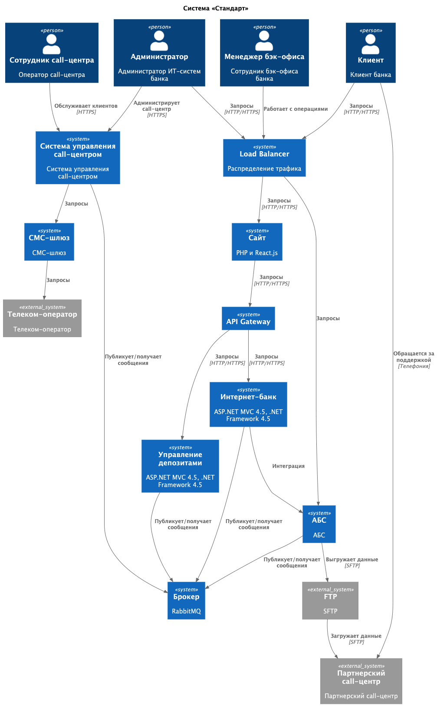
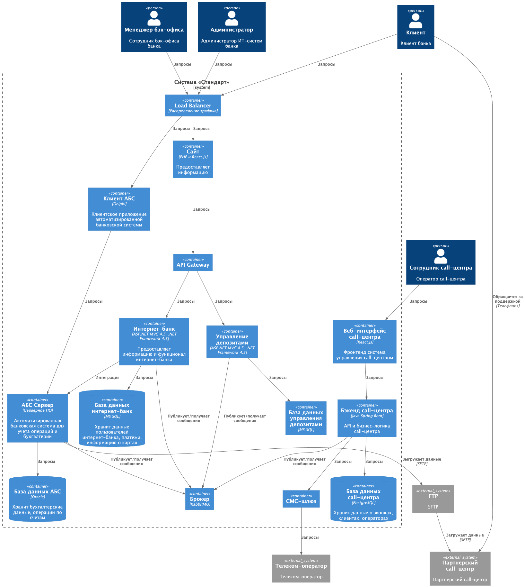
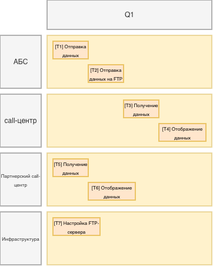

### **Название задачи:** Передача ставок в кол-центр
### **Автор:** Коваль Александр
### **Дата:** 02122025
### **Функциональные требования**
> Опишите здесь верхнеуровневые Use Cases. Их нужно оформить в виде таблицы с пошаговым описанием:

| **№** | **Действующие лица или системы**   | **Use Case**                                                                                                 | **Описание** |
|:-----:|:-----------------------------------|:-------------------------------------------------------------------------------------------------------------|:-------------|
|   1   | АБС                                | АБС отправляет данные по ставкам в брокер                                                                    |              |
|   2   | АБС                                | АБС выгружает данные по ставкам на FTP-сервер                                                                |              |
|   3   | Система call-центра                | Система call-центра получает данные по ставкам из брокера                                                    |              |
|   4   | Система call-центра                | Система call-центра отображает данные по ставкам из брокера                                                  |              |
|   5   | Система партнёрского call-центра   | Система партнёрского call-центра получает данные по ставкам из FTP-сервера                                   |              |
|   6   | Система партнёрского call-центра   | Система партнёрского call-центра отображает данные по ставкам                                                |              |
|   7   | Менеджер call-центра               | Я, как менеджер call-центра, могу проконсультировать клиента по телефона по актуальным ставкам               |              |
|   8   | Менеджер партнёрского call-центра  | Я, как менеджер партнёрского call-центра, могу проконсультировать клиента по телефона по актуальным ставкам  |              |
|       |                                    |                                                                                                              |              |

### **Нефункциональные требования**
> Опишите здесь нефункциональные требования и архитектурно значимые требования.

| **№** | **Требование**                                                                                      |
|:-----:|:----------------------------------------------------------------------------------------------------|
|   1   | АБС должна выгружать данные по ставкам на FTP-сервер раз в час                                      |
|   2   | У АБС должны быть предусмотрены повторные попытки загрузки, если возникает ошибка во время выгрузки |
|   3   | Канал работы с FTP-сервер должен быть защищен                                                       |
|       |                                                                                                     |
### **Решение**
> Приведите диаграммы контекста и контейнеров в модели C4. Опишите там основные компоненты и интеграции всех элементов решения.

> Также опишите, какой логикой вы руководствовались в ходе принятия решений и выбора технологий. Не забывайте, что необходимо учесть все функциональные и нефункциональные требования.

**Обоснование**
* Обмен данными через FTP-сервер является быстрым и дешевым решением
* Интеграция через брокер является надежным решением

### **Альтернативы**
> Опишите здесь наиболее важные альтернативные решения.

* Интеграция через REST API

**Недостатки, ограничения, риски**

> Подробно опишите здесь недостатки, ограничения и риски выбранного решения.

* Возможны утечки данных с FTP-сервера
* Возможно данные по ставкам будут не актуальны так как синхронизация происходит раз в час

### **Задачи**

* [T1] АБС должна отправлять данные по ставкам в брокер
* [T2] АБС должна отправлять данные по ставкам на FTP-сервер
* [T3] Система call-центра должна получать данные по ставкам из брокера
* [T4] Система call-центра должна отобразить данные по ставкам из брокера
* [T5] Система партнёрского call-центра должна получать данные по ставкам из FTP-сервера
* [T6] Система партнёрского call-центра должна отображать данные по ставкам
* [T7] Развертывание и настройка FTP-сервера

